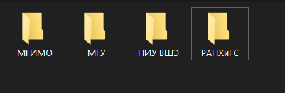
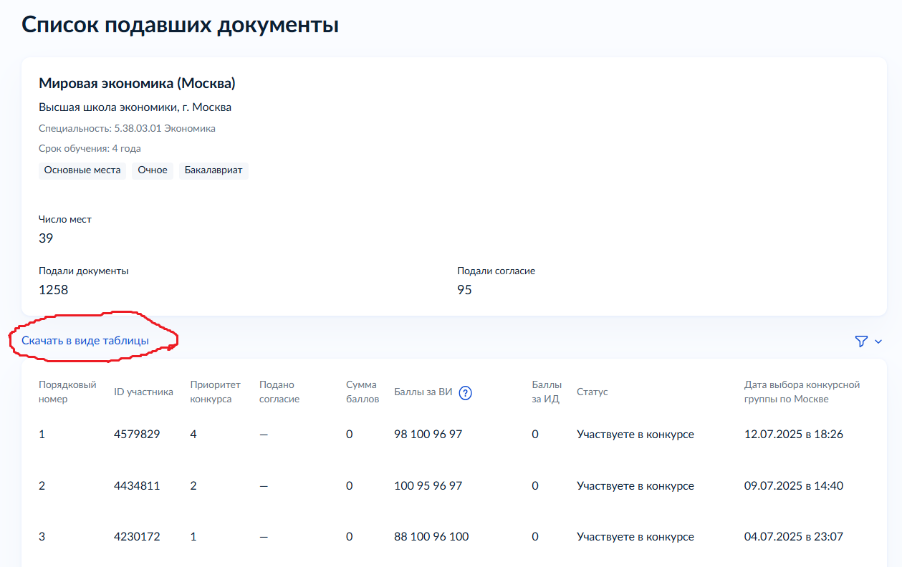

# Перовоначальная настройка
1. В папке **_Config_** откройте файл **ID.txt** (При помощи приложения блокнот или другого текстового редактора)
2. В **ID.txt** запишите ваш _ID участника_
```На изображении выше показано, как найти ID участника```
3. В папке **_lists_** создайте папки ваших университетов

# Использование
1. На суперсервисе "Госуслуги" откройте страницу интересующего вас направления и нажмите на текст _Списки подавших документы_


2. Выберите интересующее вас финансирование
   + _Основные места - Бюджетные места в общем конкурсе_
   + _Отдельная квота - Бюджетные места в конкурсе среди поступающих по особым правам_
   + _Особая квота - Бюджетные места в конкурсе среди поступающих по особым правам_
   + _Целевая квота - Места для обучающихся в рамках целевого образования_
   + _Платное - Платные места в общем конкурсе_
   * [Разница между Отдельной, Особой и целевой квотой](https://www.gosuslugi.ru/help/faq/university/175330 "Суперсевис Госуслуги")

3. Нажмите _Скачать в виде таблицы_ (После чего у вас скачается .csv файл)

4. Скачанный в пункте 3 файл, добавьте в папку вашего университета, в котором вы смотрели направление

5. Повторите для всех университетов и всех интересующих направлений
6. Запустите _PROGRAM.exe_ и наблюдайте в открывшемся окне за количеством людей в списках, расположенных выше вас